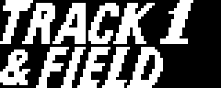

# Las dos compilaciones de cada cartucho: HYPER OLYMPIC y TRACK & FIELD

De Hyper Olympic 1 (RC-710) y de Hyper Olympic 2 (RC-711) circulan **dos
volcados distintos de 16.384 bytes cada uno**. Este documento mide en que se
diferencian, byte a byte, cruzando cada tramo con el desensamblado, que tiene
el 100 % del cartucho explicado.

La respuesta corta, con la cifra delante: **no, no es solo el logotipo, pero
por volumen casi**. En Hyper Olympic 1 cambian de verdad 1.143 bytes de 16.384
(el 6,98 %), y 860 de ellos son el guion de la pantalla del titulo, que es
donde vive el logotipo: quedan **283 bytes de cambio fuera del logotipo**. En
Hyper Olympic 2 cambian 1.047 bytes (el 6,39 %), 850 en el guion del titulo y
**197 fuera**. Y entre esos bytes de fuera hay **codigo**, no solo adorno.

---

## Los cuatro ficheros

| cartucho | compilacion | sha256 | bytes |
|---|---|---|---|
| RC-710 | HYPER OLYMPIC 1 | `0cd8a7928e10a8551d7f6fd68943a6d4a008e04a254d258413c120dda18b792e` | 16384 |
| RC-710 | TRACK & FIELD 1 | `b8988e622d10461140951ef5d072ce4f1ef66e6a8b8d795788cb3e2988338eb6` | 16384 |
| RC-711 | HYPER OLYMPIC 2 | `f254764f4bd1634f50abcdabe5813d133d719197216071772845983ffabad22d` | 16384 |
| RC-711 | TRACK & FIELD 2 | `b0cb044eb80c0cdd359e39a0f1b8727dba91de3e6de28a3ba4426a474eeafc52` | 16384 |

En lo que sigue, **A** es la compilacion HYPER OLYMPIC (la que esta
desensamblada) y **B** la compilacion TRACK & FIELD.

### Sobre el nombre del editor

MEDIDO: **ni un solo byte de las cuatro ROM dice quien las publico.** No hay
texto ASCII en ninguna de las cuatro: buscando `SONY`, `KONAMI`, `HITBIT`,
`TRACK`, `FIELD`, `OLYMPIC`, `HYPER`, `1984` y `(C) 19` con `strings -n 3` no
sale ninguna coincidencia. Tampoco llevan la marca oculta de Konami que
descubrio Manuel Pazos (ver mas abajo). Lo unico que se puede leer del binario
es **el rotulo que dibuja en pantalla**, y ese si cambia: una compilacion pone
HYPER OLYMPIC y la otra TRACK & FIELD.

Por eso este documento las llama por su rotulo. Si a una de las dos se le llama
"la de Sony" es por lo que se sepa de fuera del binario, no por lo que diga el
binario.

---

## Por que el diff crudo no sirve

MEDIDO: comparando byte a byte en la misma posicion difieren **15.107 de
16.384** en el RC-710 (92,2 %) y **15.696 de 16.384** en el RC-711 (95,8 %).
Ese numero no significa nada: la cabecera del cartucho ya declara un INIT
distinto —**0x4081 en A y 0x4080 en B**— y a partir de ahi **toda la ROM esta
desplazada**, asi que casi cada operando de dieciseis bits cae un poco mas alla
o un poco mas aca.

Alineando primero las dos compilaciones, los bytes que no casan bajan a **1.379
(8,4 %)** en el RC-710 y **1.263 (7,7 %)** en el RC-711. Y separando lo que solo
se ha movido de lo que ha cambiado, quedan los 1.143 y 1.047 bytes del
resumen.

El desplazamiento entre las dos compilaciones del RC-710 va cambiando a lo
largo del cartucho:

```
A 0x4010-0x407E  ->  B 0x4010-0x407E    +0
A 0x4081-0x4099  ->  B 0x4080-0x4098    -1     (INIT empieza un byte antes)
A 0x409A-0x474F  ->  B 0x409E-0x4753    +4
A 0x4750-0x476D  ->  B 0x4757-0x4774    +7
A 0x4771-0x4775  ->  B 0x4777-0x477B    +6
A 0x4779-0x4793  ->  B 0x477E-0x4798    +5
A 0x4797-0x4E8F  ->  B 0x479B-0x4E93    +4
A 0x4EB7-0x52E3  ->  B 0x4EB8-0x52E4    +1
A 0x52EC-0x5580  ->  B 0x52EC-0x5580     0
A 0x5584-0x55DB  ->  B 0x5583-0x55DA    -1
A 0x55DF-0x5664  ->  B 0x55DD-0x5662    -2
A 0x566A-0x569A  ->  B 0x5667-0x5697    -3
A 0x569F-0x56AD  ->  B 0x569B-0x56A9    -4
A 0x56B0-0x56B2  ->  B 0x56AA-0x56AC    -6
A 0x56B5-0x5730  ->  B 0x56AE-0x5729    -7
A 0x5734-0x578C  ->  B 0x572B-0x5783    -9
A 0x5790-0x5E21  ->  B 0x5786-0x5E17   -10
A 0x5F27-0x65C5  ->  B 0x5F1B-0x65B9   -12
A 0x65CA-0x65E2  ->  B 0x65BB-0x65D3   -15
A 0x65F2-0x660F  ->  B 0x65DD-0x65FA   -21
A 0x6645-0x6B19  ->  B 0x6622-0x6AF6   -35
A 0x6B1A-0x6B58  ->  B 0x6AFA-0x6B38   -32
A 0x6B5E-0x6B77  ->  B 0x6B3C-0x6B55   -34
A 0x6B78-0x7FFE  ->  B 0x6B59-0x7FDF   -31
```

MEDIDO: al final del cartucho, A deja **1 byte** de relleno 0xFF y B deja
**32** en el RC-710; en el RC-711, A deja **2** y B deja **12**. La compilacion
TRACK & FIELD ocupa menos.

---

## 1. El logotipo

MEDIDO. El logotipo no esta dibujado tal cual en la ROM: lo suben los patrones
del **guion largo de la pantalla del titulo** (`pantalla_del_titulo`) y lo
colocan las cuatro primeras ordenes del **guion corto del menu**
(`pantalla_del_menu`), en las filas 3 a 6 y las columnas 12 a 21 de la tabla de
nombres.

Ejecutando los dos guiones y comparando la VRAM que dejan (herramienta
`tools/pinta_largo.py`, que es la traduccion a Python de `GUION_LARGO`,
`MONTA_UN_ROTULO`, `LLENA_EL_PAPEL` y `ESTIRA_LAS_LETRAS`), **toda la
diferencia grafica del guion del titulo cae en 26 tramos y todos son del
logotipo**:

| tramo de VRAM | que es |
|---|---|
| 0x2100-0x2217 | patrones 0x20-0x43, los del logotipo |
| 0x0178-0x017E, 0x01F0-0x01F7, 0x0210-0x0217 | el color de los patrones 0x2F, 0x3E y 0x42 |

Ni un byte de diferencia en los patrones del decorado, ni en la fuente, ni en
los rotulos de las pruebas, ni en los sprites del atleta.

El rotulo que sale:

| cartucho | A | B |
|---|---|---|
| RC-710 | `HYPER 1 / OLYMPIC` | `TRACK 1 / & FIELD` |
| RC-711 | `HYPER 2 / OLYMPIC` | `TRACK 2 / & FIELD` |





El guion del menu tambien cambia porque el rotulo nuevo gasta menos casillas:
A escribe 59 casillas de la tabla de nombres y B 56; las tres que sobran son
0x38B4, 0x38B5 (fila 5, columnas 20 y 21) y 0x38D4 (fila 6, columna 20). Es el
mismo numero en los dos cartuchos.

> Nota para el `.notes`: el bloque `pantalla_del_menu` esta descrito como "el
> rotulo PLAY SELECT y los cuatro numeros de la izquierda", pero **sus cuatro
> primeros bloques colocan el logotipo del juego**, no PLAY SELECT. PLAY SELECT
> y los numeros son los dos bloques de detras (VRAM 0x390B y 0x39AB).

---

## 2. El codigo

MEDIDO. Alineando las dos compilaciones instruccion a instruccion —cada
instruccion normalizada, los operandos de dieciseis bits y el desplazamiento de
los JR/DJNZ a cero, que es el metodo de `tools/porta_notas.py`— el resultado es:

| | RC-710 | RC-711 |
|---|---|---|
| instrucciones en A / en B | 5032 / 5038 | 5345 / 5348 |
| alineadas | 5014 | 5328 |
| identicas byte a byte | 4439 | 4700 |
| solo reubicadas (mismo destino) | 575 | 628 |
| con cambio real estando alineadas | **0** | **0** |
| tramos que no casan | **19** | **14** |

O sea: **de las instrucciones que se emparejan, ni una sola apunta a otro
sitio.** Todo el cambio de codigo esta en 19 tramos (RC-710) y 14 (RC-711),
48 y 39 bytes de A respectivamente. Estos son.

### 2.1 Lo que cambia el comportamiento

**a) La sombra del mezclador del PSG.** En los dos cartuchos.

| | A | B |
|---|---|---|
| RC-710 | `0x6B59  ld a,7 / call 0x0096` (BIOS RDPSG) | `0x6B39  ld a,(0E09Fh)` |
| RC-710 | `0x6B78  ESCRIBE_EL_MEZCLADOR` | `0x6B56  ld (0E09Fh),a` delante |
| RC-710 | INIT, sin nada | `0x4099  ld a,0B8h / call 6B56h` |
| RC-711 | `0x6C95  ld a,7 / call 0x0096` | `0x6C8A  ld a,(0E09Fh)` |
| RC-711 | `0x6CB4  ESCRIBE_EL_MEZCLADOR` | `0x6CA7  ld (0E09Fh),a` delante |
| RC-711 | INIT, sin nada | `0x4099  ld a,0B8h / call 6CA7h` |

A **lee de vuelta el registro 7 del PSG** (el mezclador) con la BIOS cada vez
que enciende o apaga una voz. B **no lo lee: mantiene una copia en RAM en
0xE09F** y lee de ahi. INIT arranca la copia con 0xB8, que es el valor normal
del mezclador en MSX (los tres tonos abiertos, el ruido cerrado, el puerto A de
entrada y el B de salida), y de paso lo escribe en el PSG.

MEDIDO: en el desensamblado de A **ninguna instruccion nombra 0xE09F**;
0xE09F es el ultimo byte del bloque 0xE060-0xE09F, el de los marcadores que se
pintan. B lo aprovecha como sombra.

VALORACION (no medido en maquina real): esto tiene toda la pinta de un arreglo
de compatibilidad. Releer el registro 7 del PSG no se comporta igual en todas
las maquinas, y una copia en RAM se lo quita de encima.

Hay una asimetria entre los dos cartuchos, y es MEDIDA:

- En el RC-711, `MUEVE_EL_SONIDO` empieza en B con
  `0x6C45 ld a,(0E09Fh) / 0x6C48 call 6CA7h`: **vuelve a escribir el mezclador
  desde la sombra en cada pasada**.
- En el RC-710, `MUEVE_EL_SONIDO` empieza en B con `0x6AF7 ld a,(0E09Fh)` **y
  nada mas**. El registro A se pisa en `0x6B27 ld a,(ix+002h)` antes de que
  nadie lo lea: esa instruccion **no hace nada**. Son tres bytes muertos.

**b) 0xE022 se limpia al repetir el intento.** En los dos cartuchos.

```
RC-710   A  0x474A  OTRA_VEZ_A_LA_LINEA:  ld hl,0 / ld (0E02Ch),hl / jp PINTA_EL_TURNO
         B  0x474E                        xor a / ld l,a / ld h,a / ld (0E02Ch),hl
                                          ld (0E022h),a / jp PINTA_EL_TURNO
RC-711   A  0x476F   igual que arriba
         B  0x4773   igual que arriba, con el ld (0E022h),a metido
```

0xE022 es, segun el desensamblado, **quien pasa a la siguiente ronda**. A no lo
toca al volver a montar la prueba tras un intento fallido; B lo pone a cero.
Es la unica diferencia de codigo que cambia una variable del juego.

**c) Solo en el RC-711: un umbral que sube en uno.**

```
A  0x530C  cp 011h        ; "con el otro por debajo de 0x11"
B  0x530F  cp 012h
```

Esta en `MIRA_SI_HAY_QUE_REFRESCAR`, justo detras de `pop bc / ld a,c`. La
condicion "C por debajo de 0x11" pasa a "C por debajo de 0x12". En el RC-710 el
mismo sitio (`0x52D2` en A, `0x52D3` en B) lleva `cp 011h` en las dos
compilaciones: **el cambio es solo del RC-711**.

### 2.2 Lo que no cambia el comportamiento

Todo lo demas son instrucciones mas cortas que hacen exactamente lo mismo, o
codigo muerto que se quita. Cada una comprobada leyendo el estado con el que se
llega:

| donde | A | B | por que da igual |
|---|---|---|---|
| RC-710 0x407F, RC-711 0x407F | `reti` (`ED 4D`) | `ret` (`C9`) | el gancho H.KEYI se llama con CALL; los dos sacan la direccion de la pila. RETI ademas suelta el ciclo de reconocimiento para los perifericos de la familia Z80, que el MSX estandar no usa. Un byte menos |
| RC-710 0x476E / 0x4776 | `ld de,0E07Ah` / `ld de,0E094h` | `ld e,7Ah` / `ld e,94h` | D ya vale 0xE0 desde `0x4765 ld de,0E08Fh` |
| RC-710 0x4794 | `ld hl,0E0A7h` | `ld l,0A7h` | H ya vale 0xE0 desde `0x478F ld hl,0E020h` |
| RC-710 0x5581 | `ld hl,0E141h` | `ld l,41h` | HL vale 0xE151 desde `0x5572` |
| RC-710 0x55DC | `ld hl,0E151h` | `ld l,51h` | HL vale 0xE141 desde `0x55CD` |
| RC-710 0x5667, RC-711 0x56A9 | `ld hl,0E0A7h` | `ld l,0A7h` | HL vale 0xE0ED desde el `bit 6,(hl)` de antes |
| RC-710 0x5731 | `ld hl,0E02Eh` | `inc l` | HL vale 0xE02D |
| RC-710 0x578D | `ld hl,0E02Eh` | `ld l,2Eh` | HL vale 0xE02C |
| RC-710 0x52E4, RC-711 0x5325 | `ld a,(0E02Eh) / set 5,a / ld (0E02Eh),a` | `push hl / ld hl,0E02Eh / set 5,(hl) / pop hl` | mismo efecto en 0xE02E, un byte menos. Cambia el valor que queda en A, pero lo siguiente es `call GASTA_Y_APUNTA`, que empieza con `push de / push hl / ld b,002h` y no lo mira |
| RC-710 0x569D, RC-711 0x56DF | `ld a,066h` | `dec a` | se llega con A = 0x67 |
| RC-710 0x56B3 | `cp 001h` | `dec a` | solo se usa el flag Z, y A se pisa a continuacion |
| RC-711 0x49C6 y 0x4BB7 | `ld b,001h` | `inc b` | se llega de un `call` que acaba en `djnz`, o sea con B = 0 |
| RC-711 0x4AAD | `dec a / or a / jr nz` | `dec a / jr nz` | `dec a` ya deja el flag Z puesto: el `or a` sobra |
| RC-710 0x56AE | `jr nc,+0` | quitado | salta a la instruccion siguiente: no hace nada |
| RC-711 0x56F0 | `jr nc,+7 / ld a,(0E02Eh) / bit 6,a / jr z,+0` | quitado | los dos caminos van a parar a 0x56F9, y alli A se recarga |

---

## 3. Los datos

MEDIDO, bloque a bloque del `.notes`, con el mapa de desplazamiento para
distinguir un puntero reubicado de un puntero que apunta a otro sitio:

| | RC-710 | RC-711 |
|---|---|---|
| bloques con nombre | 92 | 98 |
| identicos o solo reubicados | 88 | 94 |
| con cambio de contenido | **4** | **4** |

Los que cambian:

| cartucho | bloque | A | B | bytes que difieren |
|---|---|---|---|---|
| RC-710 | `pantalla_del_titulo` | 860 | 858 | 200 (23 %) |
| RC-710 | `pantalla_del_menu` | 78 | 75 | 7 (9 %) |
| RC-710 | `marcador_del_salto_de_longitud` | 73 | 64 | 11 (15 %) |
| RC-710 | `marcador_del_martillo` | 84 | 70 | 28 (33 %) |
| RC-711 | `pantalla_del_titulo` | 850 | 848 | 200 (24 %) |
| RC-711 | `pantalla_del_menu` | 78 | 75 | 7 (9 %) |
| RC-711 | `marcador_de_la_jabalina` | 64 | 58 | 8 (12 %) |
| RC-711 | `rotulo_110_vallas` | 16 | 16 | 1 (6 %) |

Los dos primeros de cada cartucho son el logotipo, ya visto. Quedan dos cosas.

### 3.1 Los marcadores: la misma pantalla, mejor comprimida

MEDIDO ejecutando los dos guiones (`tools/pinta_corto.py`): en los tres casos
**la VRAM que queda es identica**, las mismas 416 direcciones (0x3960-0x3AFF)
con los mismos valores. Lo unico que cambia es como se comprime.

- `marcador_del_salto_de_longitud`: A lo pinta en **dos bloques** (uno de 384
  bytes desde 0x3960 y otro de 32 desde 0x3AE0, que van seguidos) y ademas
  parte rachas que se podian unir: `32 x 0xB0` mas `32 x 0xB0` en A es
  `64 x 0xB0` en B. B lo hace en **un bloque**. -9 bytes.
- `marcador_del_martillo`: lo mismo con las rachas. Donde A pone
  `racha de 10 x 0xC0 / 2 bytes tal cual C0 C1 / racha de 20 x 0xC1`, B pone
  `racha de 11 x 0xC0 / racha de 21 x 0xC1`. -14 bytes.
- `marcador_de_la_jabalina` (RC-711): igual. -6 bytes.

De control, `marcador_de_los_100_metros` (RC-710) sale identico en las dos
compilaciones, los mismos 74 bytes.

### 3.2 Solo en el RC-711: se corrige HURDLERS

MEDIDO. El rotulo de letra grande de la tercera prueba, `rotulo_110_vallas`,
es una lista de indices de glifo cerrada con 0xFF (el 0x11 de delante es el
tipo de rotulo). Los indices son 0-9 las cifras, 10 el espacio y de 11 en
adelante las letras de la A a la Y sin la Q, la X ni la Z.

```
A  0x64B1   11 0A 01 01 00 0A 12 1E 1B 0E 16 0F 1B 1C 0A FF
                  1  1  0     H  U  R  D  L  E  R  S
B  0x64A6   11 0A 01 01 00 0A 12 1E 1B 0E 16 0F 1C 0A 0A FF
                  1  1  0     H  U  R  D  L  E  S
```

**La compilacion HYPER OLYMPIC 2 escribe "110 HURDLERS". La compilacion
TRACK & FIELD 2 escribe "110 HURDLES", que es como se dice.** Es el unico
cambio de texto de los dos cartuchos.


(Los dos rotulos dibujados con la fuente del propio cartucho, a tamano normal:
el cartucho los estira al doble antes de subirlos.)

(La tabla de glifos esta comprobada con otros rotulos del mismo formato:
`0x6320` da " 100 METER DASH ", `0x6344` da " LONG JUMP " y `0x6351` da
"  HAMMER THROW " en el RC-710.)

---

## 4. La marca oculta de Konami

MEDIDO con `tools/marca_konami.py`, la herramienta que saca el titulo en
katakana y el numero RC que Konami escondio detras del relleno del final de
algunos cartuchos —hallazgo de Manuel Pazos (@ManuelPazosMSX), septiembre de
2021—: **ninguna de las cuatro ROM la lleva**. La herramienta sale con codigo 1
para las cuatro. Ya se sabia de las dos compilaciones HYPER OLYMPIC; las dos
TRACK & FIELD tampoco.

Los ultimos bytes utiles son 0x7FFE (HYPER OLYMPIC 1), 0x7FDF (TRACK & FIELD 1),
0x7FFD (HYPER OLYMPIC 2) y 0x7FF3 (TRACK & FIELD 2), y lo que hay detras es
relleno 0xFF, no una marca.

---

## 5. El desensamblado sirve para las dos

MEDIDO, y es la prueba mas dura de todas.

1. Se traza la compilacion TRACK & FIELD con `tools/z80trace.py` desde su
   INIT (0x4080) y su rutina de interrupcion (0x4010). Sale **sin ningun punto
   ciego** en las dos: 9332 bytes de codigo en el RC-710 y 9871 en el RC-711.
2. Se llevan las anotaciones con `tools/porta_notas.py`. Portan
   **2307 de 2315** en el RC-710 (99,65 %) y **2311 de 2323** en el RC-711
   (99,48 %).
3. Se genera el listado con `tools/mkasm.py` y se ensambla con pasmo.

```
b8988e622d10461140951ef5d072ce4f1ef66e6a8b8d795788cb3e2988338eb6  ho1sony.bin
b8988e622d10461140951ef5d072ce4f1ef66e6a8b8d795788cb3e2988338eb6  TRACK & FIELD 1
b0cb044eb80c0cdd359e39a0f1b8727dba91de3e6de28a3ba4426a474eeafc52  ho2sony.bin
b0cb044eb80c0cdd359e39a0f1b8727dba91de3e6de28a3ba4426a474eeafc52  TRACK & FIELD 2
```

**Las dos compilaciones TRACK & FIELD se reensamblan byte a byte** a partir del
listado que sale del desensamblado de HYPER OLYMPIC.

Las anotaciones que no encuentran sitio en la hermana son **exactamente los
puntos que cambian**, lo cual es un buen control cruzado:

```
RC-710: OTRA_VEZ_A_LA_LINEA (0x474A), 0x52E7, 0x5667, 0x569D,
        ENCIENDE_O_APAGA_LA_VOZ (0x6B59), 0x55DC
RC-711: OTRA_VEZ_A_LA_LINEA (0x476F), 0x49C6, 0x4AAD, 0x530C, 0x5328,
        0x56A9, 0x56DF, MIRA_EL_LIMITE_DEL_RELOJ (0x56F2),
        ENCIENDE_O_APAGA_LA_VOZ (0x6C95)
```

Lo que NO porta `porta_notas.py` son las directivas D y F, o sea el nombre y la
anchura de los bloques de datos: para dar por cerrado un desensamblado de la
compilacion TRACK & FIELD habria que volver a situarlos, que es trabajo mecanico
con el mapa de desplazamiento de arriba.

---

## 6. Cual es anterior

SUPOSICION, no medida. El binario no lleva fecha ni numero de version, asi que
esto no se puede cerrar desde la ROM. Lo que si esta medido es la direccion en
la que van los cambios, y toda apunta al mismo lado:

- la compilacion TRACK & FIELD **quita codigo muerto** que la otra tiene
  (RC-710 0x56AE, RC-711 0x56F0);
- **acorta instrucciones** sin cambiar lo que hacen, en los diecisiete sitios
  de la tabla de 2.2;
- **corrige una errata de texto** (HURDLERS por HURDLES);
- **cambia una lectura del PSG por una copia en RAM**, que es lo que se hace
  cuando algo no funciona en alguna maquina;
- y acaba ocupando menos: 32 bytes libres al final en vez de 1.

Todo eso es tipico de una revision posterior, pero **es una lectura, no una
medida**: nada del binario dice cual se fabrico antes. Y en particular, nada
del binario dice quien publico cual.

Contra esa lectura juega un detalle, tambien medido: en el RC-710 la
compilacion TRACK & FIELD deja **tres bytes muertos** en `MUEVE_EL_SONIDO`
(`0x6AF7 ld a,(0E09Fh)`, con A pisada acto seguido) que en el RC-711 son parte
de un `ld a,(0E09Fh) / call ESCRIBE_EL_MEZCLADOR` con sentido. O el parche se
aplico primero en el RC-710 a medias, o al RC-711 se le anadio despues. No se
puede decidir desde aqui.

---

## Como reproducir las medidas

Todas las herramientas de este documento estan en `tools/` y no escriben nada
fuera de su directorio de trabajo. Ninguna ROM se distribuye.

```sh
# el mapa de desplazamiento entre las dos compilaciones
python tools/desplazamiento.py A.rom A.trace.json B.rom B.trace.json desp.json

# el informe completo: codigo instruccion a instruccion y datos bloque a bloque
python tools/informe.py A.rom A.trace.json A.notes B.rom B.trace.json desp.json out.txt

# las cifras del resumen
python tools/cuentas.py A.rom A.trace.json A.notes B.rom B.trace.json desp.json <logo_ini> <logo_fin>

# que pinta un guion corto, para saber si dos guiones distintos dan lo mismo
python tools/pinta_corto.py A.rom 0x65BA B.rom 0x65AE

# que pinta un guion largo, y dibujarlo
python tools/pinta_largo.py A.rom 0x5C96 0x6002 B.rom 0x5C8C 0x5FF6
python tools/dibuja_rotulo_menu.py A.rom 0x5C96 0x6002 0x4E87 logo.png

# la marca oculta de Konami
python tools/marca_konami.py *.rom
```
